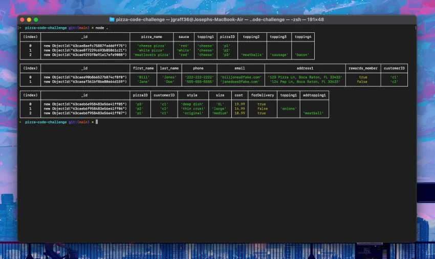

# MongoDB Code Challenge
Week 2, Day 5: Creating a mock Mongo database for a Pizza Company.

## Lessons Learned
1. Node
2. NPM
3. MongoDB
4. Query skills

To see the repo [check here](https://github.com/josephvgraffeo/pizza-co-code-challenge).
